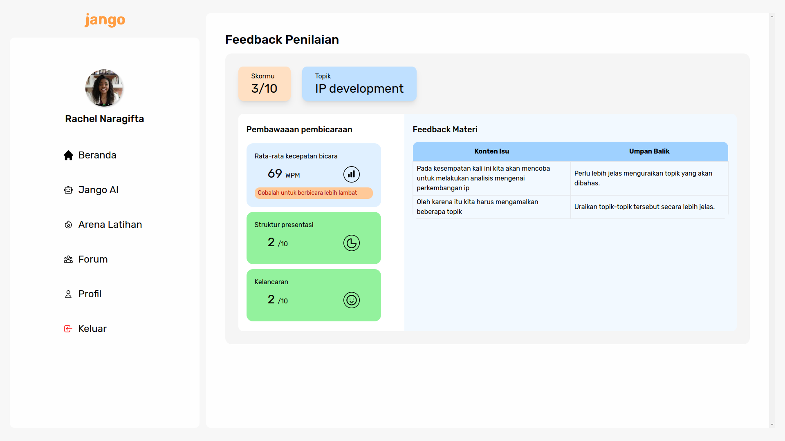
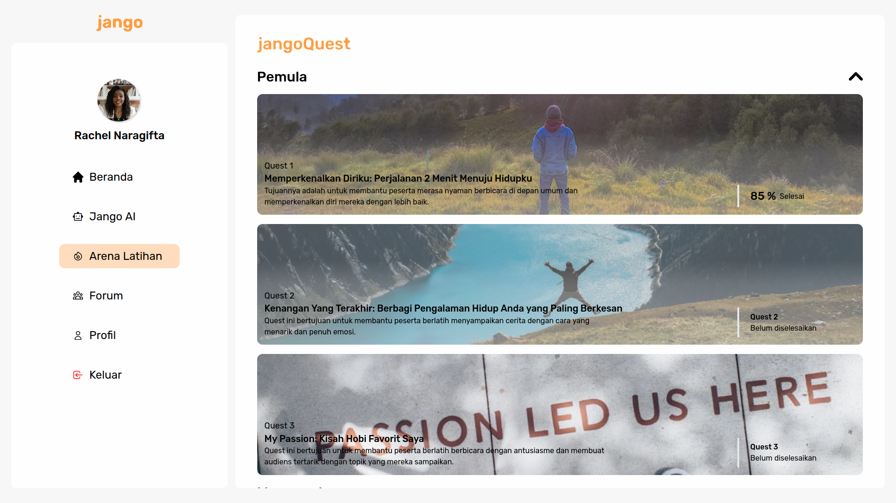
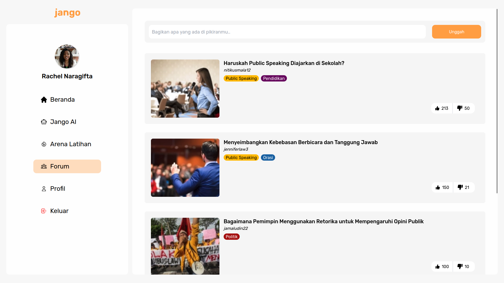
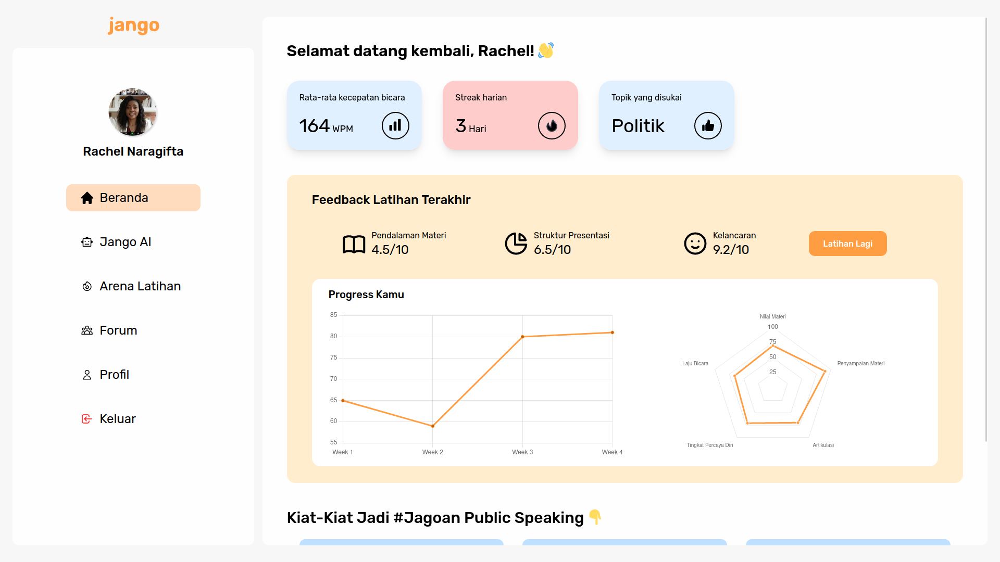

# Andalist

## Team

- **Hustler**: Diki Bagastama
- **Hipster**: Rachel Naragifta
- **Hacker**: Achmad Hadzami Setiawan

## Jango: Jagoan Ngomong

Jango adalah aplikasi berbasis website yang bertujuan untuk membantu pengguna dalam meningkatkan kemampuan _public speaking_ mereka, baik secara praktik maupun teori. Aplikasi ini menyediakan berbagai fitur yang dapat digunakan oleh pengguna, seperti:

### Minimum Viable Product

- **Feedback**: Pengguna dapat berlatih _public speaking_ dengan merekam video diri mereka sendiri, kemudian aplikasi akan memberikan feedback berupa analisis dari hasil transkrip _speech_ mereka dengan menggunakan _artificial intelligence_.

- **Quest / Arena Latihan**: Pengguna dapat menyelesaikan _quest_ yang tersedia untuk meningkatkan kemampuan _public speaking_ mereka secara terstruktur dan bertahap. Setiap _quest_ memiliki topik dan jenjang yang berbeda-beda, seperti _introduction_, _conclusion_, _body language_, dan lain-lain.

- **Forum**: Pengguna dapat berdiskusi dengan pengguna lainnya mengenai topik maupun hal-hal lain yang berhubungan dengan _public speaking_.

- **Progress Tracker**: Pengguna dapat melihat perkembangan kemampuan _public speaking_ mereka dari waktu ke waktu.

